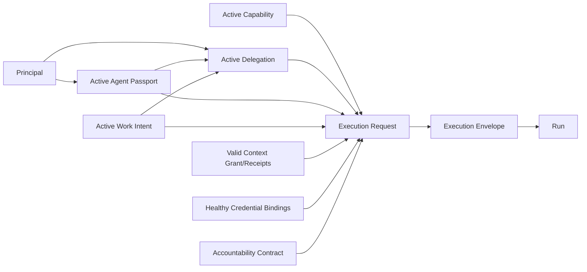

# Accountability And Execution Lifecycle Prototype

Status: rough HITL prototype

## Core Rule

Execution answers whether work ran and what it reported. Accountability answers whether required outcomes and evidence were established. These are separate axes.

```text
Identity is not delegation.
Delegation is not capability authority.
Capability activation is not execution admission.
Admission is not a Run.
Run success is not effect proof.
Effect proof is not complete accountability.
Recovery does not rewrite failure.
```

## Authority Chain



Every arrow is independently validated. Missing or stale authority produces explicit rejection or blocked state; no adjacent object implies the next.

## Identity And Intent Lifecycles

### Agent Passport

```text
issued -> active -> suspended
                 -> expired
                 -> revoked
```

Passport content is immutable by version. Configuration change creates a new Passport version. Suspension may be reversed through a new decision; expiration and revocation are terminal for that version.

### Work Intent

```text
proposed -> active -> fulfilled
                   -> cancelled
                   -> expired
```

Work Intent describes objective and constraints. Fulfillment is an attributed decision supported by linked Runs/outcomes; it grants no authority.

### Delegation

```text
proposed -> active -> suspended -> active
                   -> revoked
                   -> expired
```

Delegation binds sponsor, delegate Principal/Passport constraints, allowed intent classes, capability bounds, time window, and optional usage limits. Revocation blocks new admission; existing Runs follow explicit cancellation/recovery policy rather than disappearing.

## Capability Authority

```text
proposal
-> technical review
-> business approval
-> eligible
-> active
-> deactivated/revoked
```

Every decision targets one exact deployed Capability Contract export. New proposals do not replace the active version until explicit activation. Activation is necessary but insufficient for execution.

## Execution Admission

`execution.admit` validates atomically:

- exact active Capability Activation
- valid Principal and Agent Passport version
- active Work Intent and Delegation
- valid Context Access Grants and Context Receipts
- healthy exact Credential Binding References and revisions
- request inputs and capability preconditions
- effect types, occurrence/count/value limits, targets, and temporal bounds
- complete Accountability Contract instantiation plan
- evidence and recovery requirements
- idempotency key and request hash
- package/deployment trust and quarantine state
- envelope expiry

Success creates one immutable Execution Envelope. Identical idempotent replay returns the same envelope; conflicting key reuse fails.

## Envelope Consumption

One Execution Envelope admits exactly one Run. `run.create` atomically:

1. Revalidates time-sensitive authority, activation, credentials, trust, and expiry.
2. Claims the Envelope for one Run.
3. Creates the Run and all initial Operational Obligations.
4. Appends the admission/creation ledger events.

Identical replay returns the same Run. An Envelope cannot authorize multiple Runs.

## Run Lifecycle

```text
created -> ready -> running -> waiting
                 -> succeeded
                 -> failed
                 -> cancelled
                 -> uncertain

uncertain -> reconciled_success
          -> reconciled_failure
```

`waiting` requires a declared reason, responsible actor/system, and deadline. A Run cannot remain indefinitely active without an observable obligation.

Run state reports execution. Accountability remains separately derived from obligations, effects, evidence, and recovery.

## Effect Gate

Every external effect requires a Run-bound effect request before dispatch. Kernel checks:

- allowed effect kind and target class
- remaining count/value/rate limits
- effect-specific idempotency key
- current credential revision and scope
- cancellation/quarantine state
- required pre-effect evidence or approval
- temporal constraints

Accepted requests create an immutable admitted Effect Record before dispatch.

```text
admitted -> dispatched -> confirmed
                       -> rejected
                       -> failed
                       -> uncertain

uncertain -> reconciled_confirmed
          -> reconciled_not_applied
```

Retrying an uncertain non-idempotent effect is forbidden until reconciliation determines whether it occurred.

Compensation is a new admitted effect linked through `compensates_effect_id`; it never changes the original Effect Record.

## Evidence

Evidence Records may arrive before, during, or after execution. Submission validates attribution, subject, evidence kind, integrity hash, collection time, and contract requirements.

Evidence can satisfy an obligation only when the Accountability Contract's exact rule accepts it. Agent assertion alone cannot set evidence or obligation status.

## Operational Obligations

Run creation instantiates exact obligations from the Accountability Contract:

```text
open -> satisfied
open -> breached
open -> waived (authorized decision)
```

`overdue` is derived from deadline. Satisfaction after deadline does not erase breach; recovery/correction may satisfy a new linked obligation.

Examples:

- required effect reaches confirmed terminal state
- customer-visible output exists
- evidence packet is complete
- notification is delivered
- uncertain effect is reconciled
- failed work is escalated within deadline

## Accountability Projection

Derived independently from Run status:

```text
open
satisfied
breached
recovery_open
accepted_loss
```

Examples:

```text
Run: succeeded    Accountability: open
Reason: evidence pending

Run: failed       Accountability: satisfied
Reason: failure was correctly contained, evidenced, and escalated

Run: uncertain    Accountability: recovery_open
Reason: external effect requires reconciliation
```

No interface may flatten these into one `success` boolean.

## Operational Escalation

Created when a declared condition requires intervention:

- obligation breached or approaching deadline under policy
- effect uncertain
- authority or credential becomes invalid during work
- cancellation cannot safely stop completed/partial effects
- recovery choice requires human judgment
- agent repeatedly fails or stalls

```text
open -> acknowledged -> resolved
                     -> superseded
```

Escalation records subject, cause, deadline, required decision, responsible route, and linked evidence. It is not an unstructured alert.

## Corrective Work

Butler or another supervisor may propose a corrective Work Intent linked to the source Run, Effect Record, Operational Obligation, Escalation, or Recovery Case.

Corrective work then follows the normal chain:

```text
new Work Intent
-> normal Delegation
-> normal Capability Activation
-> new Execution Envelope
-> new Run
```

No privileged supervisor command path exists.

## Recovery Case

```text
open -> planned -> authorized -> executing
                               -> recovered
                               -> failed
                               -> accepted_loss
```

Recovery strategies are declared by capability/accountability contracts:

- reconcile
- retry after reconciliation
- resume from checkpoint
- compensate
- manual remedy
- accept loss with authorized rationale

Recovery authorization scales with effect/risk. Recovery execution creates new Work Intent, admission, Run, Effect Records, and Evidence Records. Original history remains unchanged.

## Cancellation

Cancelling Work Intent or Delegation blocks new admission but does not pretend existing effects vanished. Active Runs receive a cancellation request:

- before dispatch/effect: stop and record cancellation
- during idempotent safe step: stop at declared checkpoint
- after or during uncertain effect: enter uncertainty/recovery path
- after confirmed effect: complete required evidence, then compensate only through authorized recovery

Hard process termination is an Execution Substrate action and may increase uncertainty; it is not synonymous with business cancellation.

## Timeout And Stalling

Timers derive from Work Intent, capability temporal constraints, Envelope expiry, Run waiting deadlines, effect deadlines, and Operational Obligations. Deadline crossings append explicit transition/events and route accountability; models do not decide whether time elapsed.

Repeated stale heartbeats or waiting deadlines may cause Kernel to mark a Run stalled and open an Operational Escalation. Butler interprets likely cause and proposes corrective work.

## Duplicate Handling

Distinct idempotency domains prevent accidental reuse:

- execution admission key -> one Envelope
- Run creation key -> one Run per Envelope
- effect key -> one admitted effect per business target/action
- evidence key/hash -> one evidence submission
- recovery action key -> one recovery operation

Conflicting reuse is a visible conflict, never a silent replay.

## Decisions During Prototype

- One Execution Envelope admits exactly one Run. Batch, recurring, and parallel work creates separate envelope/Run pairs under shared Work Intent; idempotent replay returns the same objects.
- Every interface displays Run execution status and the separately derived Accountability Projection; no single success boolean may flatten them.
- Every external effect receives immediate Kernel admission before dispatch. Batch admission is allowed only for atomically enumerated exact effects; no adapter receives an ambient effect budget.
- Append-only reconciliation evidence and a Recovery Case may advance uncertain Run/Effect projections to reconciled outcomes while permanently preserving the original uncertainty and `was_uncertain` history.
- Packages declare eligible authority roles, but every waiver and accepted-loss outcome requires an exact human/environment authority decision. Predictable low-risk exceptions must be explicit Accountability Contract conditions rather than waivers.
- Run cancellation or failure does not automatically suspend an Agent Passport. Repeated failures route to Butler review; predeclared hard safety violations may impose a temporary hold, while suspension or revocation remains a separate authority transition.

## Prototype Outcome

The lifecycle preserves a continuous exact chain from Principal, Passport, Work Intent, Delegation, active Capability, context and credentials, through one Envelope and one Run, to individually gated Effects, Evidence, Obligations, Escalation, and Recovery. Execution and accountability remain separate, uncertainty is reconciled without erasure, and corrective work re-enters through normal authority rather than privileged supervision.
