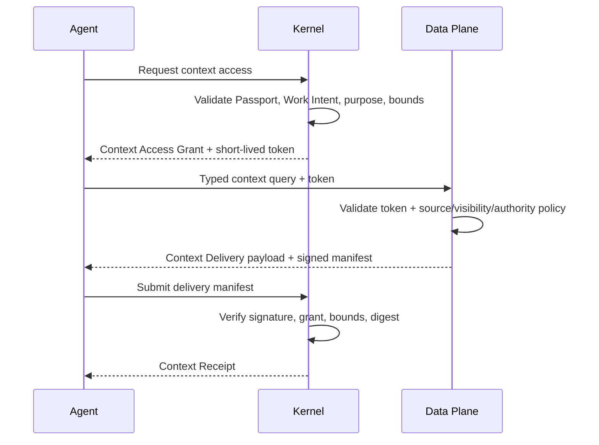

# Kernel And Data Plane Context Contract Prototype

Status: rough HITL prototype

## Boundary

```text
Kernel authorizes who may request what context, for which Work Intent.
Data Plane decides what governed context can actually be disclosed.
Data Plane supplies payload and business authority/freshness claims.
Kernel stores exact delivery receipts, never business context payloads.
```

Neither side can grant the other's authority:

- Kernel cannot declare business data true or fresh.
- Data Plane cannot grant delegation, capability activation, credentials, or execution authority.
- An agent receives context only when Kernel grant and Data Plane policy both allow it.

## Contract Flow



Kernel may provide a non-persistent streaming proxy for runtimes that cannot call Data Plane directly. Proxying does not change ownership or permit payload retention.

## Data Plane Binding

Kernel stores no Data Plane credentials or business records in this object.

```json
{
  "schema_version": "alphonse.data_plane_binding.v0.1",
  "binding_id": "data_plane_customer_prod",
  "environment_id": "env_customer_prod",
  "provider_kind": "alphonse_data",
  "endpoint_ref": "https://data.customer.example/context",
  "contract_versions": ["alphonse.context_exchange.v0.1"],
  "data_plane_identity": "did:web:data.customer.example",
  "signing_key_refs": ["key:data-context-2026-01"],
  "credential_binding_ref": "data_plane.mtls",
  "status": "active",
  "verified_at": "2026-07-13T18:00:00Z"
}
```

Lifecycle:

```text
proposed -> verified -> active -> suspended -> active
                               -> revoked
```

Suspension/revocation blocks new retrieval but never removes existing Context Receipts.

## Context Access Grant

```json
{
  "schema_version": "alphonse.context_access_grant.v0.1",
  "grant_id": "context_grant_123",
  "environment_id": "env_customer_prod",
  "data_plane_binding_id": "data_plane_customer_prod",
  "principal_id": "principal_agent",
  "agent_passport_ref": {"id": "passport_inventory", "version": 4},
  "work_intent_id": "intent_answer_inventory",
  "purpose": "answer_customer_inventory_question",
  "skill_export_ref": {
    "package_digest": "sha256:PACKAGE",
    "export_id": "check_inventory",
    "contract_version": "1.0.0",
    "export_digest": "sha256:SKILL"
  },
  "allowed_context_classes": ["published", "live_operational"],
  "subject_seeds": [{"kind": "product", "id": "sku-123"}],
  "allowed_link_types": ["inventory_location", "substitute_product"],
  "allowed_operations": ["get", "expand_one_hop", "live_query"],
  "sensitivity_ceiling": "customer_safe",
  "freshness_requirements": {
    "inventory_quantity": {"maximum_age_seconds": 300, "on_stale": "block"}
  },
  "bounds": {
    "maximum_hops": 2,
    "maximum_subjects": 50,
    "maximum_records": 200,
    "maximum_bytes": 262144,
    "maximum_requests": 10
  },
  "valid_from": "2026-07-13T18:05:00Z",
  "expires_at": "2026-07-13T18:15:00Z",
  "status": "active"
}
```

Grant lifecycle:

```text
issued -> active -> exhausted
                 -> expired
                 -> revoked
```

Grant is read-only. Context proposals, publication, corrections, and source changes use separate typed capabilities and transitions.

## Short-Lived Context Token

Kernel signs a compact token referencing, not duplicating, the Grant:

```json
{
  "issuer_environment_id": "env_customer_prod",
  "grant_id": "context_grant_123",
  "principal_id": "principal_agent",
  "passport_version": 4,
  "work_intent_id": "intent_answer_inventory",
  "data_plane_binding_id": "data_plane_customer_prod",
  "nonce": "nonce_123",
  "issued_at": "2026-07-13T18:06:00Z",
  "expires_at": "2026-07-13T18:07:00Z"
}
```

Data Plane retrieves exact grant claims through a signed introspection response or verifies a bounded embedded claim set. Token replay and request counts remain grant-scoped.

## Typed Context Query

```json
{
  "schema_version": "alphonse.context_query.v0.1",
  "query_id": "query_123",
  "idempotency_key": "inventory_sku_123_1",
  "grant_id": "context_grant_123",
  "mode": "live_query",
  "query_contract": {
    "id": "inventory_availability",
    "version": "1.0.0",
    "digest": "sha256:QUERY_CONTRACT"
  },
  "subject_refs": [{"kind": "product", "id": "sku-123"}],
  "requested_fields": ["available_quantity", "as_of"],
  "requested_freshness_seconds": 300,
  "bounds": {"maximum_records": 5, "maximum_bytes": 16384}
}
```

Query modes:

- `pinned_release`: exact immutable Context Release and record versions
- `live_query`: current bounded Operational State observation
- `progressive_expand`: independently authorized one-hop traversal from previously disclosed subject
- `interpretive_query`: reviewed context carrying epistemic state and disputes

Every expansion independently rechecks subject, link type, target publication/authority, sensitivity, purpose, and remaining bounds.

## Context Delivery

Payload and manifest are logically separate.

```json
{
  "schema_version": "alphonse.context_delivery_manifest.v0.1",
  "delivery_id": "delivery_123",
  "query_id": "query_123",
  "grant_id": "context_grant_123",
  "data_plane_binding_id": "data_plane_customer_prod",
  "recipient_principal_id": "principal_agent",
  "payload_digest": "sha256:PAYLOAD",
  "payload_bytes": 4096,
  "items": [
    {
      "subject_ref": {"kind": "product", "id": "sku-123"},
      "context_class": "live_operational",
      "record_ref": {"kind": "inventory_observation", "id": "obs-789", "version": 44},
      "record_digest": "sha256:OBSERVATION",
      "authority_rule_ref": {"id": "inventory_quantity", "version": 3},
      "source_ref": {"kind": "source_system", "id": "erp"},
      "observed_at": "2026-07-13T18:05:30Z",
      "fresh_until": "2026-07-13T18:10:30Z",
      "freshness": "fresh",
      "epistemic_state": "observed",
      "discrepancy_refs": [],
      "sensitivity": "customer_safe"
    }
  ],
  "limitations": [],
  "generated_at": "2026-07-13T18:06:10Z",
  "expires_at": "2026-07-13T18:10:30Z",
  "signature_key_ref": "key:data-context-2026-01",
  "signature": "base64:SIGNATURE"
}
```

The payload contains the disclosed fields. The manifest contains only references, claims, hashes, bounds, and limitations needed for verification and audit.

## Context Receipt

Kernel verifies the signed manifest against the Grant and creates:

```json
{
  "schema_version": "alphonse.context_receipt.v0.1",
  "receipt_id": "context_receipt_123",
  "environment_id": "env_customer_prod",
  "grant_id": "context_grant_123",
  "query_id": "query_123",
  "delivery_id": "delivery_123",
  "principal_id": "principal_agent",
  "work_intent_id": "intent_answer_inventory",
  "payload_digest": "sha256:PAYLOAD",
  "delivery_manifest_digest": "sha256:MANIFEST",
  "data_plane_signature_verified": true,
  "item_claims": [
    {
      "record_ref": {"kind": "inventory_observation", "id": "obs-789", "version": 44},
      "record_digest": "sha256:OBSERVATION",
      "authority_rule_ref": {"id": "inventory_quantity", "version": 3},
      "freshness": "fresh",
      "fresh_until": "2026-07-13T18:10:30Z"
    }
  ],
  "received_at": "2026-07-13T18:06:11Z"
}
```

One Receipt represents one delivery, with bounded item claims. Kernel stores no payload or business assertions.

## Authority And Freshness

Data Plane must qualify every delivered item:

- context class
- exact record/release/source reference and digest
- Authority Rule reference/version
- observed/published time
- freshness state and deadline
- epistemic state
- discrepancy references
- sensitivity
- limitations or unavailable fields

Kernel validates that claims satisfy the Grant and Capability/Skill context requirements. It does not independently infer that the business claim is true.

Freshness outcomes are deterministic:

- `fresh`: satisfies requirement
- `stale`: age exceeds requirement
- `expired`: no longer usable under policy
- `unknown`: observation time/authority unavailable

Grant policy declares `block`, `allow_with_disclosure`, `fallback_to_release`, or `escalate`. A fallback release must be exact and separately authorized.

## Unavailability

Data Plane returns structured unavailable outcomes instead of empty payloads or guesses:

```json
{
  "outcome": "unavailable",
  "code": "source_freshness.unknown",
  "source_ref": {"kind": "source_system", "id": "erp"},
  "last_observation_at": "2026-07-13T17:45:00Z",
  "allowed_fallbacks": ["pinned_release"],
  "operator_route_ref": "integration_inventory_support"
}
```

Integration repair remains owned by the Deterministic Integration/operator. Kernel and agents route blocked work; they do not silently maintain ETL.

## Advisories And Revocation

Data Plane may issue signed advisories against exact releases, records, Authority Rules, source observations, or signing keys:

- `superseded`: newer context exists; prior receipt remains valid historical evidence
- `withdrawn`: block new delivery under normal policy
- `compromised`: block new use and recheck active pre-effect Runs

Existing Receipts are never deleted. A compromised advisory before an external effect gate can block dispatch and open an Operational Escalation. Completed Runs preserve the exact context they used and enter review/recovery only when policy requires it.

## Identity Disclosure

Data Plane receives only the minimum signed claims needed for its policy:

- environment
- pseudonymous Principal reference
- Passport version/class where required
- Work Intent and purpose class
- Grant identity and bounds
- applicable role/attribute assertions

Human profile data, unrelated roles, prompts, reasoning, and broader authority are not disclosed.

## Security Properties

- mutual service identity and rotating signing keys
- short-lived nonces/tokens
- idempotent queries and delivery IDs
- exact schema versions and digests
- payload hash verified by recipient/runtime
- signatures verified before Receipt creation
- secrets rejected from manifests/receipts
- bounds enforced by both planes
- deny on disagreement, unsupported schema, invalid signature, or clock outside tolerance
- customer payload retention remains Data Plane/runtime policy, never implicit Kernel storage

## Decisions During Prototype

- Context payload flows directly from Data Plane to agent/runtime by default under a short-lived bounded Kernel token. Kernel stores the signed delivery receipt only; a non-persistent stream proxy is optional for incompatible runtimes.
- Effective context access is the strict intersection of Kernel Grant and Data Plane policy. Either plane may deny; neither may override the other.
- Kernel creates one Context Receipt per bounded delivery with item-level references, digests, authority, and freshness claims; oversized manifests remain external by exact hash.
- Data Plane may cache live observations only under versioned Source Policy and Authority Rules. Cache access preserves original observation time and freshness and discloses cache age; Kernel stores no cached payload.
- Compromised context blocks pre-effect Runs, sends dispatched uncertainty to reconciliation, and opens policy-driven impact review/recovery for completed work through exact Context Receipt links without rewriting outcomes.
- Context Access Grants remain read-only. Proposal, correction, and publication use separate typed capabilities with Kernel request authority, independent Data Plane policy/publication authority, and payload-free Kernel transition receipts.

## Prototype Outcome

Kernel authorizes bounded purpose-specific context access; Data Plane independently authorizes disclosure and supplies signed payload manifests containing exact authority, freshness, provenance, sensitivity, discrepancy, and limitation claims. Payload flows directly to the runtime by default. Kernel stores delivery-level receipts with item-level claims, enabling exact execution linkage and advisory impact analysis without owning customer business context.
