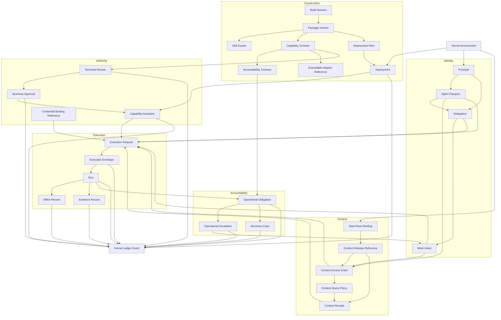

# Minimum Kernel Object Graph Prototype

Status: rough HITL prototype

## Design Test

Kernel owns an object only when deterministic ownership is required to answer at least one question:

- What exact software definition is installed?
- Who or what acted, and why?
- Who delegated or approved authority?
- What exact version is active?
- What context could the agent access?
- What effects were admitted, attempted, completed, or left uncertain?
- What evidence, obligation, escalation, or recovery remains?

Domain meaning, model reasoning, source data, UI state, and provider implementation remain outside Kernel.

## Rough Graph

## Kernel-Owned Definitions

| Object | Minimum responsibility |
|---|---|
| Kernel Environment | Isolated customer authority domain |
| Build Session | Attributed control record for construction; mutable contents remain user space |
| Package Version | Immutable package content and dependency hash |
| Skill Export | Immutable package-owned method indexed by exact export hash; no independent authority |
| Deployment Plan | Exact package composition and customer configuration proposal |
| Deployment | Exact installed composition and lifecycle state |
| Capability Contract | Immutable declared reads, writes, effects, requirements, and risk |
| Accountability Contract | Immutable expected outcome, evidence, deadline, escalation, and recovery policy |
| Executable Adapter Reference | Immutable implementation digest and substrate requirements |

## Kernel-Owned Authority

| Object | Minimum responsibility |
|---|---|
| Principal | Typed attributable identity; grants no authority |
| Agent Passport | Exact agent/runtime/configuration identity |
| Delegation | Sponsor-to-agent authority relationship and bounds |
| Work Intent | Exact present objective and constraints |
| Context Access Grant | Exact context access permitted for Passport plus Work Intent |
| Context Receipt | Exact external context delivery references, claims, and hash without payload |
| Technical Review | Exact-version engineering decision |
| Business Approval | Exact-version customer authority decision |
| Capability Activation | Exact active capability version in one Environment |
| Credential Binding Reference | External secret reference, scopes, health, and revision; never secret material |
| Execution Request | Proposed run inputs before admission |
| Execution Envelope | Immutable exact admitted authority; not a run |

## Kernel-Owned Operational Truth

| Object | Minimum responsibility |
|---|---|
| Run | Durable lifecycle of one admitted execution |
| Effect Record | One attempted, completed, rejected, compensated, or uncertain external effect |
| Evidence Record | Attributed evidence reference and integrity hash |
| Operational Obligation | Derived completion requirement from Accountability Contract plus Run |
| Operational Escalation | Required human or agent intervention for an unresolved obligation |
| Recovery Case | Explicit retry, reconciliation, compensation, or accepted-loss lifecycle |
| Kernel Ledger Event | Append-only meaningful authority or operational transition |

## Referenced, Not Owned

| Reference | Canonical owner |
|---|---|
| Data Plane Binding | Customer configuration; endpoint and trust metadata only |
| Context Release | Data Plane |
| Context subjects, records, links, freshness, authority | Data Plane |
| Skill and evaluation source evidence | Package and Data Plane, exact hashes referenced |
| Secret material | External credential provider |
| Model reasoning and plans | Intelligence Plane unless promoted into a typed proposal |
| Runtime process/container state | Execution Substrate; meaningful outcomes enter Kernel records |
| UI projections | Butler or other user-space products |
| Build Workspace drafts and notes | Builder tooling |

## Candidate Invariants

1. Every authoritative object belongs to exactly one Kernel Environment.
2. Definitions are immutable; lifecycle changes append decisions/events or update derived projections.
3. `current` and `active` remain distinct for packages, deployments, and capabilities.
4. No object derives authority merely from identity, context, skill, evaluation, or model output.
5. Every effect traces to Package Version, Capability Contract, Agent Passport, Work Intent, Delegation, Execution Envelope, and Run.
6. Every effectful Run creates inspectable obligations even when execution fails before producing an effect.
7. External-plane records enter Kernel only as exact typed references, hashes, and bounded claims.
8. Generic ledger events do not replace domain-specific state machines.

## Decisions During Prototype

- One typed Principal root covers humans, agents, and deterministic systems for attribution while granting no authority.
- Kernel owns the bounded Build Session control record; user space owns mutable Build Workspace contents.
- Package Version owns immutable Skill Exports; Kernel indexes exact hashes and derives verification from external evidence and runtime configuration.
- Deployment records exact installed composition; Capability Activation separately identifies the exact deployed capability export authorized for business use.
- Context Access Grant supports pinned releases and bounded live query policies; every delivery creates a payload-free Context Receipt binding exact references and claims.
- Effect Record and Evidence Record are immutable first-class Run-linked objects so asynchronous effects, late evidence, uncertainty, and compensation remain independently addressable.
- Operational Obligations preserve satisfied, breached, or authorized-waived outcomes; overdue is derived. Recovery uses a separate authorized case and never rewrites the original failure history.

## Prototype Outcome

The minimum graph has three categories:

1. Immutable definitions and installed composition.
2. Exact identity, intent, delegation, access, approval, activation, and execution authority.
3. Append-only operational truth for runs, effects, evidence, obligations, escalation, and recovery.

All domain meaning, model reasoning, source context payloads, secrets, substrate telemetry, and UI projections remain outside Kernel and enter only through typed references or validated transition requests.
